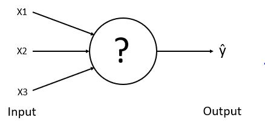
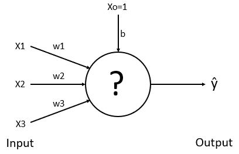
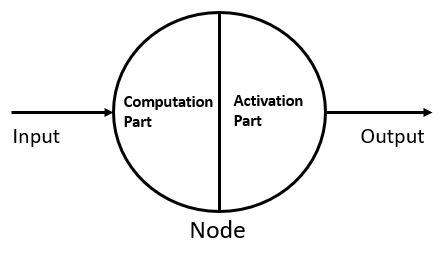

# How does a single neuron work
Hello Everyone:wave: 

&nbsp;&nbsp;&nbsp;&nbsp;&nbsp;&nbsp;&nbsp;&nbsp;&nbsp;&nbsp;&nbsp;&nbsp; Till now we have seen different types and structures of neural networks. In this blog, we will see the general working of a single neuron.

&nbsp;&nbsp;&nbsp;&nbsp;&nbsp;&nbsp;&nbsp;&nbsp;&nbsp;&nbsp;&nbsp;&nbsp;&nbsp;&nbsp;&nbsp;&nbsp;&nbsp;&nbsp;&nbsp;&nbsp;&nbsp;&nbsp;&nbsp;&nbsp;&nbsp;&nbsp;&nbsp;&nbsp;&nbsp;&nbsp;&nbsp;&nbsp;&nbsp;&nbsp;&nbsp;&nbsp;&nbsp;&nbsp;&nbsp;&nbsp;&nbsp;&nbsp;&nbsp;&nbsp;&nbsp;&nbsp;&nbsp;&nbsp; 

Here you can see that we give input (i.e X1, X2, X3) to the node, and the node performs some task and predict y (y-hat) value. What actually happens inside the node?

### Weight and Bias

> Weights and biases (commonly referred to as w and b) are the learnable parameters of a machine learning model.

&nbsp;&nbsp;&nbsp;&nbsp;&nbsp;&nbsp;&nbsp;&nbsp;&nbsp;&nbsp;&nbsp;&nbsp;&nbsp;&nbsp;&nbsp;&nbsp;&nbsp;&nbsp;&nbsp;&nbsp;&nbsp;&nbsp;&nbsp;&nbsp;&nbsp;&nbsp;&nbsp;&nbsp;&nbsp;&nbsp;&nbsp;&nbsp;&nbsp;&nbsp;&nbsp;&nbsp;&nbsp;&nbsp;&nbsp;&nbsp;&nbsp;&nbsp;&nbsp;&nbsp;&nbsp;&nbsp;&nbsp;&nbsp; 

**Weights** control the signal (or the strength of the connection) between two neurons.  In other words, a weight decides how much influence the input will have on the output.

**Biases** are an additional input into the next layer.  These units are not influenced by the previous layer (they do not have any incoming connections) but they do have outgoing connections with their own weights.  The bias unit guarantees that even when all the inputs are zeros there will still be activation in the neuron.

In the above figure, X1, X2, X3 are inputs, w1, w2, w3 are weights and b is the bias value. Xo=1 means bias value is independent of the input signals.

#### Now let's get inside the node:

The node is divided into two parts :
* Computation part
* Activation part

&nbsp;&nbsp;&nbsp;&nbsp;&nbsp;&nbsp;&nbsp;&nbsp;&nbsp;&nbsp;&nbsp;&nbsp;&nbsp;&nbsp;&nbsp;&nbsp;&nbsp;&nbsp;&nbsp;&nbsp;&nbsp;&nbsp;&nbsp;&nbsp;&nbsp;&nbsp;&nbsp;&nbsp;&nbsp;&nbsp; 

**Computation Part:-** A computation is done by using the input signals, weights, and biases to generate value. This computation is done with the help of the *feed-forward-algorithm*(which we will discuss in the next blog).

**Activation Part:-** The value which is generated, feed into the *Activation function*. As per the result generated by the activation function, the value is sent to the next node or produce output.

In this blog, we learn the meaning of weights and biases and see the inside functions of a node. In future blogs, we will see the details of feed-forward-algorithm and activation functions.

Thank you:smile:

Happy Learning:books:

